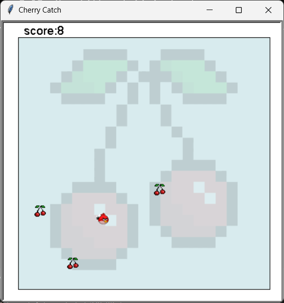

# Cherry-catch
A simple 2D game Developed in python

It's a simple 2D game Developed in python with turtle module ans some random functions. It also has a GUI and listeners for keyboard controls. 
It mainly contains square area where randomly cherries appear and move Inside the area. Also there is a bird who tries to catch those cerries. we can control the bird by using arrows in keyboard. The number of cherries catched will be registered as the score.

It mainly contains 2 GUI screens

  * Game Play

    

  
  * Game Over

